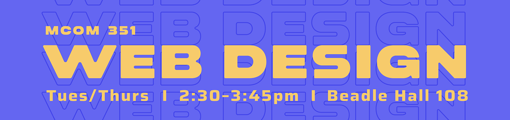

## Web Design (MCOM 351) Fall 2026

##### <a href="https://dsu-26.github.io/sept-tm/" target="_blank">Quick link to our demo repository</a>

### Our goals this semester

You’ll see the “student learning outcomes” listed in the course syllabus, but I thought I would outline them here, too. 

By the end of this course, I expect each of you will be able to:

1. **Conduct basic user research** and sift your findings to identify user needs, goals, and design opportunities for a web project. *(In-person observation and digital research)*
2. **Apply design-thinking methods** to define a problem, generate ideas, prototype solutions, and iteratively refine a web design based on research and feedback. *(Hands-on workshops / Figma)*
3. **Design compelling web experiences** by applying principles of visual hierarchy, typography, color, composition, accessibility, and user-centered design. *(Hands-on workshops / Figma)*
4. **Develop a design concept** into a functional, responsive website using semantic HTML, foundational CSS, and some simple JavaScript. *(Visual Studio Code)*
5. **Iterate and collaborate** to create a cohesive web design project by incorporating user feedback, explaining and documenting design decisions, and using industry tools to collaborate, manage, and publish the project. *(Git and GitHub)*

### If you get stuck on anything, reach out to me on Slack or email!
